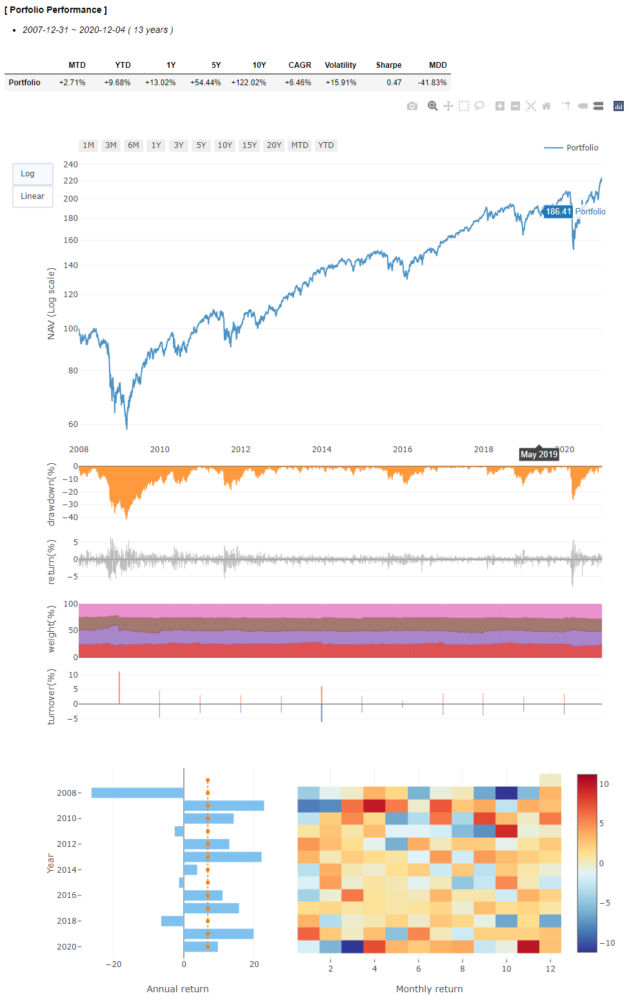

# Snowball
**Snowball은 자산 배분 및 투자 전략을 손쉽게 시뮬레이션/백테스팅할 수 있는 파이썬 패키지입니다.**

&nbsp;
## 설치 방법
소스 코드는 [GitHub](https://github.com/HongJunhyoung/Snowball)에 올라와 있으며 최신버전은 pip로 설치할 수 있습니다.
```sh
pip install snowball
```
&nbsp;
## 사용 방법
*결과 리포트내 챠트가 plotly로 구현되어 있으므로 jupyter notebook에서 실행하는 것을 권장합니다.*
&nbsp;
### 0. 자산 가격 데이터 준비
- 투자할 자산(주식, ETF, Index, Commodity, etc.)의 일일 가격 데이터를 준비합니다.
- 데이터 형태는 pandas DataFrame이어야 합니다.
```py
print(price_data)
```
|date|ETF_A|ETF_B|ETF_C|
|---|---|---|---|
|2000-11-21|140.2723|203.29|2317.70|
|2000-11-27|140.2707|204.39|2318.63|
|2000-11-28|140.2121|204.87|2318.44|
|...|...|...|...|
|2020-12-01|137.8898|200.26|2316.95|
|2020-12-02|139.8906|200.32|2316.53|
|2020-12-03|138.7654|200.19|2315.77|
&nbsp;
### 1. 백테스팅
- backtest() 함수를 이용하여 정기적으로 리밸런싱하는 포트폴리오를 시뮬레이션합니다.
- 리밸런싱 시점은 월말, 분기말, 년말을 지원하며 사용자가 직접 지정도 가능합니다.
- 리밸런싱 방법은 고정 비중, Risk Budgeting 2가지를 지원합니다.
```py
import snowball as sb

# 고정 비중 
portfolio = sb.backtest(prices=price_data, 
                        schedule='EOM', 
                        weight={'ETF_A': 0.3, 'ETF_B': 0.3, 'ETF_C': 0.4}, 
                        start='2000-12-31')
```
```py
# Risk Budgeting
portfolio = sb.backtest(prices=price_data, 
                        schedule='EOM', 
                        risk_budget={'ETF_A': 0.5, 'ETF_B': 0.4, 'ETF_C': 0.1}, 
                        start='2000-12-31')
```
- 리밸런싱 옵션
    - schedule
        - 'EOM' : 월말
        - 'EOQ' : 분기말
        - 'EOY' : 년말
        - 위의 약어 대신 리밸런싱하고 싶은 일자를 list로 직접 입력 가능합니다.
    - weight 
        - 각 자산별 비중을 dictionary로 입력합니다.
        - 비중의 합은 1이어야 합니다. 
        - risk_budget 옵션과 동시에 사용할 수 없습니다.
    - risk_budget
        - 각 자산별 버짓을 dictionary로 입력합니다.
        - 버짓의 합은 1이어야 합니다.
        - 리스크 산출시에는 과거 1년간의 일일수익률로 계산한 covariance matrix를 이용합니다.
        - weight 옵션과 동시에 사용할 수 없습니다.
&nbsp;
### 2. 결과 확인
- backtest()가 반환한 오브젝트의 report() 함수를 이용하여 결과를 확인합니다.
- 챠트는 plotly로 구현하였으며 interactive하게 조정할 수 있습니다(jupyter lab에서 챠트 표시가 정상적으로 되지 않는 경우 [extension](https://www.npmjs.com/package/@jupyterlab/plotly-extension)을 설치하여 주십시오).
```py
portfolio.report()
```


- 또는 오브젝트 내의 결과 데이터를 직접 처리할 수 있습니다.
```py
print(portfolio.stats, portfolio.returns, portfolio.weights, portfolio.trades) 
```
&nbsp;
## Sample
*아래 예제를 실행하기 전에 [yfinance 패키지](https://github.com/ranaroussi/yfinance)를 우선 설치해 주세요.*  
*또 다른 예제들은 sample 디렉토리안의 노트북을 참고하시기 바랍니다.*
&nbsp;
#### 주식/채권 60/40
- 한국 주식 ETF와 한국 국채3년 ETF를 매월 60/40으로 리밸런싱
```py
import yfinance as yf
import snowball as sb

data = yf.download('069500.KS 114820.KS', period='MAX')['Adj Close']

bal64 = sb.backtest(prices=data, 
                    schedule='EOM', 
                    weight={'069500.KS': 0.6, '114820.KS':0.4},
                    start='2012-12-01')
bal64.report()
```