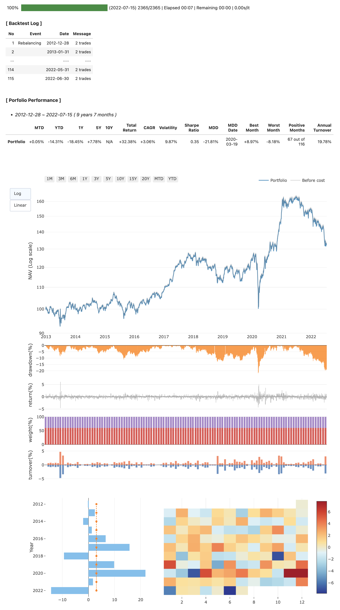

# Snowball
**Snowball은 자산 배분 전략을 손쉽게 백테스팅할 수 있는 파이썬 패키지입니다.**

&nbsp;
## 설치 방법
소스 코드는 [GitHub](https://github.com/HongJunhyoung/Snowball)에 올라와 있으며 최신버전은 pip로 설치할 수 있습니다.
```sh
pip install snowball
```
&nbsp;
## 실행 예시
*아래 예제를 실행하기 전에 [FianceDataReader 패키지](https://github.com/FinanceData/FinanceDataReader)를 우선 설치해 주세요.*  
*또 다른 예제들은 docs 디렉토리안의 sample 노트북을 참고하시기 바랍니다.*
&nbsp;
#### 한국 주식 채권 60/40
- 2013년부터 매월말 리밸런싱: 한국 주식 ETF 60%, 한국 국채 ETF 40%
- 거래 비용(수수료 및 슬리피지) 0.2% 가정
```py
import snowball as sb
import FinanceDataReader as fdr

etfs = ['069500', '114820']
data = pd.concat([fdr.DataReader(etf)['Close'].rename(etf) for etf in etfs], axis=1)

bt = sb.run_backtest(prices=data, 
                     schedule='EOM', 
                     rule={'069500': 0.6, '114820': 0.4},
                     cost=0.002,
                     start='2012-12-01')
bt.report()
```

&nbsp;
## 사용 방법
*결과 리포트내 챠트가 plotly로 구현되어 있으므로 jupyter notebook에서 실행하는 것을 권장합니다.*
&nbsp;
### 1. 자산 가격 데이터 준비
- 투자할 자산(주식, ETF, Index, Commodity, etc.)의 일일 가격 데이터를 준비합니다.
- 데이터 타입은 Pandas DataFrame이어야 합니다.
```py
print(price_data)
```
|date|ETF_A|ETF_B|ETF_C|
|---|---|---|---|
|2000-11-21|140.2723|203.29|2317.70|
|2000-11-27|140.2707|204.39|2318.63|
|2000-11-28|140.2121|204.87|2318.44|
|...|...|...|...|
|2020-12-01|137.8898|200.26|2316.95|
|2020-12-02|139.8906|200.32|2316.53|
|2020-12-03|138.7654|200.19|2315.77|
&nbsp;
### 2. 백테스팅
- run_backtest() 함수를 이용하여 간단하게 포트폴리오의 성과를 시뮬레이션할 수 있습니다.
- 리밸런싱 시점은 월말, 분기말, 년말, 사용자 정의 일자를 지원합니다.
- 리밸런싱 방법은 동일 비중, 리스크 패리티, 정적 배분, 사용자 정의 규칙을 지원합니다.
```py
import snowball as sb

# 동일 비중 / 월말 리밸런싱
bt = sb.run_backtest(prices=price_data, 
                     schedule='EOM', 
                     rule='EqualWeight',
                     start='2000-12-31')
```
```py
# 리스크 패리티 / 분기초(분기말 1영업일후) 리밸런싱 
bt = sb.run_backtest(prices=price_data, 
                     schedule='EOQ+1', 
                     rule='RiskParity',
                     start='2000-12-31')
```
```py
# 정적 배분 / 매년말 5영업일전 리밸런싱
bt = sb.run_backtest(prices=price_data, 
                     schedule='EOY-5', 
                     rule={'ETF_A': 0.6, 'ETF_B': 0.4},
                     start='2000-12-31')
```
```py
# 사용자 정의 규칙 / 지정일자
class MyRule(sb.Rule):
    def __init__(self):
        ...

    def calculate(self, date, *args, **kwargs):
        if date < pd.to_datetime('2005-01-01'):
            weights = {'ETF_A': 0.7, 'ETF_B': 0.3}
        else:
            weights = {'ETF_A': 0.3, 'ETF_B': 0.7}
        return pd.Series(weights)

my_rule = MyRule() 
my_schedule = ['2001-06-30', '2005-06-30']
bt = sb.run_backtest(prices=price_data, 
                     schedule=my_schedule,
                     rule=my_rule,
                     start='2000-12-31')
```
&nbsp;
### 3. 성과 분석
- run_backtest()가 반환한 오브젝트의 report() 함수를 이용하여 결과를 확인합니다.
- jupyter lab에서 챠트 표시가 정상적으로 되지 않는 경우 [plotly extension](https://www.npmjs.com/package/@jupyterlab/plotly-extension)을 설치하여 주십시오.
- 챠트 때문에 노트북 렌더링이 느려지는 경우에는 charts='static' 또는 charts=None 옵션을 사용하시기 바랍니다.
```py
bt.report()
```

- 또는 결과 데이터를 직접 처리하여 직접 분석하실 수 있습니다.
```py
print(bt.log, bt.stats, bt.returns, bt.weights, bt.trades) 
```
